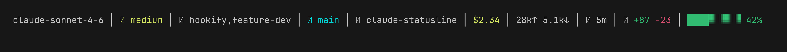
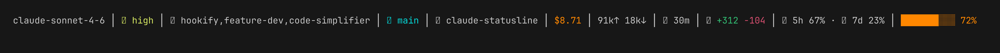

# claude-statusline

My Claude Code statusline and supporting hooks. Renders a compact, ANSI-colored status bar showing model, cost, tokens, duration, git branch, worktree, active skills, context window usage, and more — all read from the JSON Claude Code pipes to the statusline command.


**API session** (cost + tokens + duration + lines + context bar):


**Claude.ai plan session** (rate limits + higher context usage):


## Requirements

- Node.js 18+
- A [Nerd Font](https://www.nerdfonts.com/) in your terminal (for `󰾅` `󰉋` `󰷈` `󰔚` `󰃭` glyphs)

## Install

Clone the repo:

```sh
git clone https://github.com/michalschroeder/claude-statusline.git <repo>
```

Add to `~/.claude/settings.json` (replace `<repo>` with your clone path):

**Statusline:**
```json
"statusLine": {
  "type": "command",
  "command": "node <repo>/hooks/statusline.js"
}
```

**Skill-tool logger (optional — required for skills chip):**
```json
"hooks": {
  "PreToolUse": [
    {
      "matcher": "Skill",
      "hooks": [{ "type": "command", "command": "<repo>/hooks/log-skill.sh" }]
    }
  ]
}
```

**Slash-command logger (optional — required for skills chip):**
```json
"hooks": {
  "UserPromptSubmit": [
    { "hooks": [{ "type": "command", "command": "<repo>/hooks/log-slash-skill.sh" }] }
  ]
}
```

Alternatively, symlink individual files into `~/.claude/hooks/`.

## Configuration

Set `STATUSLINE_SEGMENTS` to render only the named segments, in the order listed. Unset = render all (current behaviour).

In `~/.claude/settings.json`:

```json
"env": {
  "STATUSLINE_SEGMENTS": "model,cost,tokens,context"
}
```

Segment names:

| name | what it shows |
|---|---|
| `model` | display name |
| `effort` | effort level |
| `skills` | last 3 invoked skills |
| `style` | output style (non-default) |
| `vim` | vim mode |
| `branch` | ⎇ git branch |
| `worktree` | ⊕ worktree name |
| `agent` | agent name |
| `dir` | directory label |
| `addeddirs` | +N added dirs |
| `cost` | $ cost |
| `tokens` | input↑ output↓ |
| `duration` | ⏱ session duration |
| `lines` | +added -removed |
| `ratelimits` | 5h / 7d usage % |
| `context` | context bar |

Unknown names are ignored; absent data still hides the segment.

## Files

- `hooks/statusline.js` — statusline renderer; reads JSON from stdin, writes ANSI to stdout
- `hooks/log-skill.sh` — `PreToolUse` hook; logs `Skill` tool invocations to `/tmp/claude-skills-<session>.log`
- `hooks/log-slash-skill.sh` — `UserPromptSubmit` hook; logs `/slash` skill invocations to the same log

## How it works

Segments shown left to right:

- **model** — display name (e.g. `claude-sonnet-4-6`)
- **effort** — effort level when set
- **skills** — last 3 unique skills invoked this session, most-recent-first; `+N` when more than 3
- **output style** — shown only when non-default
- **vim mode** — when vim mode is active
- **⎇ branch** — current git branch; read directly from `.git/HEAD` (no subprocess); supports worktree indirection; truncated at 50 chars
- **⊕ worktree** — worktree name when inside a worktree
- **agent** — agent name when set
- **dir** — basename of current directory; shows parent project name when inside a `.claude/worktrees/<name>/` path
- **cost** — session cost with color thresholds: green < $1, yellow $1–$4.99, orange $5–$9.99, red ≥ $10
- **tokens** — input↑ output↓, compacted (k/M suffixes)
- **duration** — total session duration (s / m / h m)
- **lines** — lines added/removed
- **rate limits** — 5h and 7d usage percentages when available
- **context bar** — block-fill bar with percentage; color thresholds: green < 50% used, yellow 50–64%, orange 65–79%, 💀 blink-red ≥ 80%

**Worktree convention:** the `⎇` chip is hidden when the branch name matches `worktree-<name>` (the `⊕` chip already conveys it). It reappears when the branch diverges (manual checkout, detached HEAD, rename).

**Skills chip:** reads `/tmp/claude-skills-<session>.log`; each line is `<timestamp> <skill-name>`. Written by the two bash hooks. `plugin:skill` entries have the prefix stripped. Uses `${CLAUDE_CONFIG_DIR:-$HOME/.claude}` for skill-existence checks.

## License

MIT
