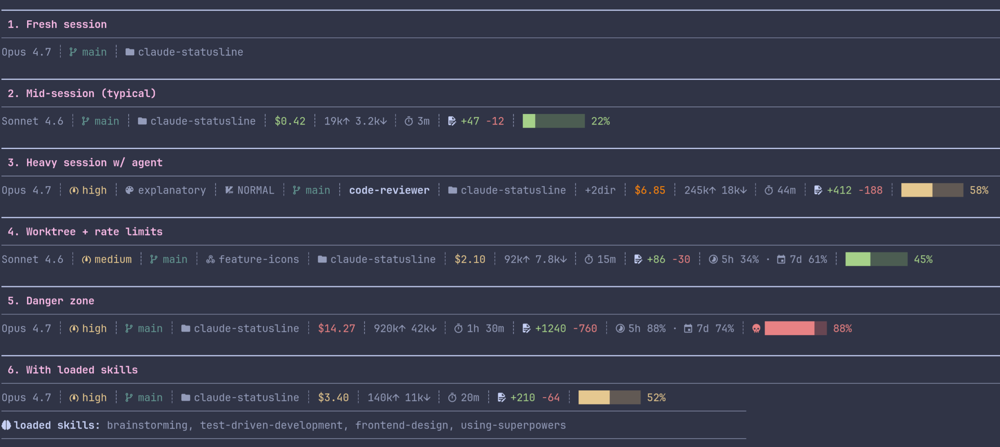

# claude-statusline

My Claude Code statusline and the two hooks that feed it. One compact ANSI line with the stuff I actually look at: model, cost, tokens, duration, git branch, worktree, active skills, context window. All of it pulled from the JSON Claude Code pipes in.




To reproduce locally, run `bash demo/screenshots.sh`.

## Requirements

- Node.js 18+
- A [Nerd Font](https://github.com/ryanoasis/nerd-fonts) if you want the `nerd` icon set — I use `JetBrainsMono Nerd Font`, but any official Nerd Font works (they're all patched `--complete`, so they all carry the Material Design Icons glyphs the statusline uses). The other two icon sets need no font setup. See [Icons](#icons).

## Install

The fast way: paste [`SETUP_PROMPT.md`](SETUP_PROMPT.md) into a Claude Code session. It'll clone the repo, edit `settings.json`, pick an icon mode, and wire up the hooks for you.

Doing it by hand? Clone first:

```sh
git clone https://github.com/michalschroeder/claude-statusline.git <repo>
```

Then add to `~/.claude/settings.json` (swap `<repo>` for your clone path):

**Statusline:**
```json
"statusLine": {
  "type": "command",
  "command": "node <repo>/hooks/statusline.js"
}
```

**Skill-tool logger** (only needed if you want the skills chip):
```json
"hooks": {
  "PreToolUse": [
    {
      "matcher": "Skill",
      "hooks": [{ "type": "command", "command": "<repo>/hooks/log-skill.sh" }]
    }
  ]
}
```

**Slash-command logger** (also for the skills chip):
```json
"hooks": {
  "UserPromptSubmit": [
    { "hooks": [{ "type": "command", "command": "<repo>/hooks/log-slash-skill.sh" }] }
  ]
}
```

**Skills-log cleanup** (deletes the session log when you exit, sweeps anything older than 30 days):
```json
"hooks": {
  "SessionEnd": [
    { "hooks": [{ "type": "command", "command": "<repo>/hooks/cleanup-skills-log.sh" }] }
  ]
}
```

If you'd rather, symlink the individual files into `~/.claude/hooks/`.

## Icons

Three icon sets, picked with `STATUSLINE_ICONS`:

| value | requires |
|---|---|
| `nerd` | A [Nerd Font](https://github.com/ryanoasis/nerd-fonts) installed and selected in your terminal (I use `JetBrainsMono Nerd Font`; any will work) |
| `unicode` | Any modern Unicode-capable font (almost every desktop terminal) |
| `ascii` | Nothing. Pure ASCII, works anywhere |

The `nerd` example is the screenshot at the top. GitHub's UI has no Nerd Font, so inline nerd glyphs would just show up as tofu boxes here.

Here's the `unicode` set with the same payload as the "mid-session" panel in that screenshot:

```text
Sonnet 4.6 ┊ ⎇ main ┊ ▸ claude-statusline ┊ $0.42 ┊ 19k↑ 3.2k↓ ┊ ⏱ 3m ┊ Δ +47 -12 ┊ ██░░░░░░░░ 22%
```

And `ascii`:

```text
Sonnet 4.6 | git: main | dir: claude-statusline | $0.42 | 19k^ 3.2kv | t: 3m | d +47 -12 | ##-------- 22%
```

The full glyph table for each mode lives in `ICON_SETS` inside [`hooks/statusline.js`](hooks/statusline.js).

**First run:** if `STATUSLINE_ICONS` is unset and there's no cached choice yet, the statusline falls back to `ascii` and prints a one-line hint. Set the env var when you're ready to upgrade:

```json
"env": {
  "STATUSLINE_ICONS": "nerd"
}
```

The cache lives at `~/.cache/claude-statusline/icons`. Delete it if you want the hint back. The env var always overrides the cache.

## Configuration

Set `STATUSLINE_SEGMENTS` to limit which segments render and in what order. Leave it unset to get everything (the default).

In `~/.claude/settings.json`:

```json
"env": {
  "STATUSLINE_SEGMENTS": "model,cost,tokens,context"
}
```

Segment names:

| name | what it shows |
|---|---|
| `model` | display name |
| `effort` | effort level |
| `skills` | last 3 invoked skills |
| `style` | output style (non-default) |
| `vim` | vim mode |
| `branch` | git branch |
| `worktree` | worktree name |
| `agent` | agent name |
| `dir` | directory label |
| `addeddirs` | +N added dirs |
| `cost` | $ cost |
| `tokens` | input / output token counts |
| `duration` | session duration |
| `lines` | +added -removed |
| `ratelimits` | 5h / 7d usage % |
| `context` | context bar |

Unknown names get dropped. Segments with no data don't render anyway.

## Files

- `hooks/statusline.js` - the renderer. Reads JSON from stdin, writes one ANSI line to stdout.
- `hooks/log-skill.sh` - `PreToolUse` hook. Logs `Skill` tool invocations to `${XDG_STATE_HOME:-$HOME/.local/state}/claude-statusline/skills/<session>.log`.
- `hooks/log-slash-skill.sh` - `UserPromptSubmit` hook. Logs `/slash` skill invocations to the same file.
- `hooks/cleanup-skills-log.sh` - `SessionEnd` hook. Deletes the session's skill log and sweeps any older than 30 days.

## How it works

Segments, left to right:

- **model** - display name (e.g. `claude-sonnet-4-6`)
- **effort** - effort level, when set
- **skills** - last 3 unique skills used this session, newest first. Adds `+N` when there are more
- **output style** - only shows up when it isn't `default`
- **vim mode** - when vim mode is on
- **branch** - current git branch. Read straight from `.git/HEAD`, no subprocess. Handles worktree indirection. Truncated past 50 chars
- **worktree** - worktree name, when you're in one
- **agent** - agent name, when set
- **dir** - basename of the current directory. Inside `.claude/worktrees/<name>/` it shows the parent project's name instead
- **cost** - session cost. Green under $1, yellow $1 to $4.99, orange $5 to $9.99, red at $10+
- **tokens** - input and output counts, compacted with k/M suffixes
- **duration** - total session time (s / m / h m)
- **lines** - lines added and removed
- **rate limits** - 5h and 7d usage percentages, when the payload includes them
- **context bar** - block-fill bar plus percentage. Green under 50% used, yellow 50 to 64%, orange 65 to 79%, blink-red plus a skull glyph at 80%+

**Worktree convention:** when you're in a worktree and the branch name matches `worktree-<name>`, the branch chip is hidden. The worktree chip already says it. The branch chip comes back the moment the branch diverges (manual checkout, detached HEAD, rename).

**Skills chip:** reads `${XDG_STATE_HOME:-$HOME/.local/state}/claude-statusline/skills/<session>.log`, where each line is `<timestamp> <skill-name>`. The two bash hooks write it. `plugin:` prefixes get stripped. Skill-existence checks use `${CLAUDE_CONFIG_DIR:-$HOME/.claude}`.

## License

MIT
