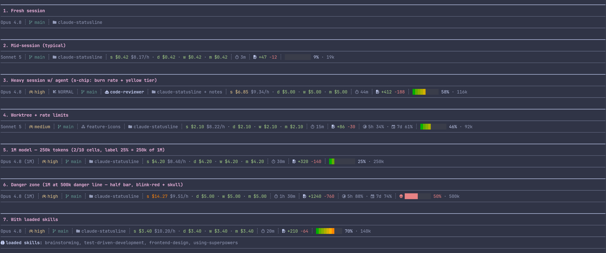

# claude-statusline

My Claude Code statusline and the hooks that feed it. One compact ANSI line with the stuff I actually look at: model, cost, duration, git branch, worktree, active skills, context window with input tokens. Most of it comes from the JSON Claude Code pipes in; the loaded-skills part needs a couple of custom hooks.




To reproduce that locally, run `bash demo/screenshots.sh`.

## Requirements

- Node.js 18+
- `jq` if you want the loaded-skills line. The logging hooks use it, and it isn't bundled on most distros or on macOS (`apt install jq` / `brew install jq`). The renderer itself doesn't need it.
- A [Nerd Font](https://github.com/ryanoasis/nerd-fonts) if you want the `nerd` icon set. I use `JetBrainsMono Nerd Font`, but any official one works, since they're all patched `--complete` and carry the Material Design Icons glyphs the statusline uses. The other two icon sets need no font setup. See [Icons](#icons).

## Install

The fast way: paste [`SETUP_PROMPT.md`](SETUP_PROMPT.md) into a Claude Code session. It'll clone the repo, edit `settings.json`, pick an icon mode, and wire up the hooks for you.

Doing it by hand? Clone first:

```sh
git clone https://github.com/michalschroeder/claude-statusline.git <repo>
```

Then add this to `~/.claude/settings.json`, swapping `<repo>` for your clone path. It's one JSON object. If you already have `statusLine`, `hooks` or `env` keys, merge into them instead of pasting a second copy:

```json
{
  "statusLine": {
    "type": "command",
    "command": "node <repo>/hooks/statusline.js"
  },
  "hooks": {
    "PreToolUse": [
      {
        "matcher": "Skill",
        "hooks": [{ "type": "command", "command": "<repo>/hooks/log-skill.sh" }]
      }
    ],
    "UserPromptSubmit": [
      { "hooks": [
        { "type": "command", "command": "<repo>/hooks/log-slash-skill.sh" },
        { "type": "command", "command": "node <repo>/hooks/refresh-cost-cache.js" }
      ]}
    ],
    "SessionEnd": [
      { "hooks": [{ "type": "command", "command": "<repo>/hooks/cleanup-skills-log.sh" }] }
    ]
  }
}
```

Only `statusLine` is required. The rest buy you specific things:

| entry | needed for |
|---|---|
| `PreToolUse` (matcher `Skill`) + `UserPromptSubmit` → `log-slash-skill.sh` | the loaded-skills line. Needs `jq` |
| `UserPromptSubmit` → `refresh-cost-cache.js` | the `d`/`w`/`m` cost chips. Without it they never update, though the `s` chip still works |
| `SessionEnd` | deleting the session's skill log and sweeping any older than 30 days |

Make the bash hooks executable:

```sh
chmod +x <repo>/hooks/*.sh
```

If you'd rather, symlink the individual files into `~/.claude/hooks/`.

### Verify

```sh
echo '{"model":{"display_name":"Claude"},"workspace":{"current_dir":"/tmp","project_dir":"/tmp"}}' | node <repo>/hooks/statusline.js
```

That prints one ANSI-colored line plus a dim rule. Restart Claude Code, or open a new session, so it picks up the settings change.

## Icons

Three icon sets, picked with `STATUSLINE_ICONS`:

| value | requires |
|---|---|
| `nerd` | A [Nerd Font](https://github.com/ryanoasis/nerd-fonts) installed and selected in your terminal (I use `JetBrainsMono Nerd Font`; any will work) |
| `unicode` | Any modern Unicode-capable font, which means almost every desktop terminal |
| `ascii` | Nothing. Pure ASCII, works anywhere |

The `nerd` example is the screenshot at the top. GitHub's UI has no Nerd Font, so inline nerd glyphs would just show up as tofu boxes here.

The `unicode` set, with the same payload as the "mid-session" panel in that screenshot:

```text
Sonnet 5 ┊ ⎇ main ┊ ▸ claude-statusline ┊ s $0.42 $8.17/h · d $0.42 · w $0.42 · m $0.42 ┊ ⏱ 3m ┊ Δ +47 -12 ┊ ░░░░░░░░░░ 9% · 19k
```

And `ascii`:

```text
Sonnet 5 | git: main | dir: claude-statusline | s $0.42 $8.17/h , d $0.42 , w $0.42 , m $0.42 | t: 3m | d +47 -12 | ---------- 9% , 19k
```

The full glyph table for each mode lives in `ICON_SETS` inside [`hooks/statusline.js`](hooks/statusline.js).

If `STATUSLINE_ICONS` is unset and nothing is cached yet, the first run falls back to `ascii` and prints a one-line hint. Set the env var when you're ready to upgrade. Putting it in `~/.claude/settings.json` under `env` is the portable option, since it survives however you launch Claude Code:

```json
"env": {
  "STATUSLINE_ICONS": "nerd"
}
```

A shell-level export (`export STATUSLINE_ICONS=nerd` in `.zshrc`/`.bashrc`) also works, but only when Claude Code is launched from a shell that sourced it.

The cache lives at `~/.cache/claude-statusline/icons`. Delete it if you want the hint back. The env var always wins over the cache.

## Configuration

Everything is configured with environment variables, set under `env` in `~/.claude/settings.json`. All of them are optional.

| variable | default | what it does |
|---|---|---|
| `STATUSLINE_SEGMENTS` | all segments | allowlist plus render order; a `;` forces a fixed multi-line layout. See [Segments](#segments) |
| `STATUSLINE_ICONS` | `ascii` on first run | `nerd` / `unicode` / `ascii`. See [Icons](#icons) |
| `STATUSLINE_MONTHLY_BUDGET` | `1000` | monthly budget driving d/w/m chip colors; `0` hides those chips |
| `STATUSLINE_COST_MULTIPLIER` | `1` | scales the displayed cost to match a plan meter. See [Matching your plan's billing page](#matching-your-plans-billing-page) |
| `STATUSLINE_TIMEZONE` | system local | IANA zone deciding the day/week/month cost boundaries. See [Timezone](#timezone) |
| `STATUSLINE_PRICING_NO_FETCH` | unset | set it to anything to block the background price fetch and stay on the bundled snapshot |

The statusline also reads two variables it doesn't own: `CLAUDE_CONFIG_DIR`, Claude Code's own config dir, used here only as a per-profile key for state, and `XDG_STATE_HOME`, the base for the state dir. See [State dir](#state-dir).

### Segments

Set `STATUSLINE_SEGMENTS` to limit which segments render and in what order. Leave it unset to get everything, which is the default.

In `~/.claude/settings.json`:

```json
"env": {
  "STATUSLINE_SEGMENTS": "model,cost,context"
}
```

Segment names:

| name | what it shows |
|---|---|
| `model` | display name |
| `effort` | effort level |
| `vim` | vim mode |
| `branch` | git branch |
| `worktree` | worktree name |
| `agent` | agent name |
| `dir` | directory label, plus any added dirs |
| `cost` | session + daily/weekly/monthly cost |
| `duration` | session duration |
| `lines` | +added -removed |
| `ratelimits` | 5h / 7d usage % |
| `context` | context bar + input token count |

Unknown names get dropped. Segments with no data don't render anyway.

The loaded-skills display isn't a segment. It renders on its own line under the rule, and `STATUSLINE_SEGMENTS` has no effect on it. See [Skills lines](#skills-lines).

### Line wrapping

By default, active segments greedy-wrap onto as many lines as they need to fit your real terminal width. A short or sparse session stays on one line; a long one breaks at segment boundaries rather than wrapping raggedly mid-chip. Width comes from the real TTY columns, or the `COLUMNS` env var Claude Code sets on the piped statusline command, or 80 as a last resort.

To force a fixed layout instead, use `;` in `STATUSLINE_SEGMENTS` to split segments into specific lines. A `,` still separates segments within a line:

```json
"env": {
  "STATUSLINE_SEGMENTS": "model,effort,vim,branch,worktree,agent,dir;cost,duration,lines,ratelimits,context"
}
```

That always renders exactly two lines, whatever the width.

## Cost tracking

The cost segment shows a session chip (`s $X.XX`) plus daily, weekly and monthly chips (`d`/`w`/`m`) covering spend across all sessions. Costs are recomputed from raw token counts × LiteLLM per-token prices, never from Claude Code's reported `cost.total_cost_usd`. The price table ships as a bundled snapshot (`data/model_prices.json`) and refreshes in the background at most once every 24h.

The d/w/m totals are rebuilt once per prompt by the `UserPromptSubmit` hook (`hooks/refresh-cost-cache.js`), off the render hot path. The renderer just reads the cache and folds in the current session's live cost.

`STATUSLINE_MONTHLY_BUDGET` controls the budget-relative coloring of the d/w/m chips, where daily = monthly/30 and weekly = monthly×7/30. Unset gives you the $1000/mo default, `0` hides the d/w/m chips and keeps the session chip, and a number sets your own budget:

```json
"env": {
  "STATUSLINE_MONTHLY_BUDGET": "300"
}
```

The session chip keeps absolute USD tiers: green under $5, yellow under $10, orange under $20, red at $20 and above. Once the session has run 60s or more it also gets a dim burn-rate suffix `$X/h`, which is spend ÷ elapsed time straight from the payload, with no state kept.

> **`/clear` resets the `s` chip.** Since Claude Code v2.1.211, `/clear` starts a new session and zeroes the payload's cost, duration and lines totals, so `s`, `duration` and `lines` start fresh. The `d`/`w`/`m` totals keep your pre-clear spend, since it still belongs to today. On older Claude Code these fields accumulated across `/clear` for the life of the process.

### Timezone

`STATUSLINE_TIMEZONE` decides which calendar day a cost lands in, and where the today, this-week and this-month windows start. It takes an IANA name. Unset, empty or unrecognized means your system's local zone.

```json
"env": {
  "STATUSLINE_TIMEZONE": "Europe/Warsaw"
}
```

It's deliberately separate from setting `TZ` under `env`, which would leak into every subprocess Claude Code spawns. Only the statusline reads this one. A change re-buckets the cache on the next prompt.

An Enterprise spend limit resets at 00:00 UTC on the 1st, which your console shows in local time, e.g. `2:00 AM GMT+2`. Set `STATUSLINE_TIMEZONE` to `UTC` if you want the `m` chip's month to line up with that reset.

### Staying accurate without updating the repo

Prices are fetched from LiteLLM into your own state dir, in the background, at most once a day. An old clone still gets current rates without a `git pull`.

Two things keep that working when a new model ships. First, the fetch is triggered by need rather than by the clock: seeing a model it can't price exactly, the refresh hook asks for a refresh immediately instead of waiting out the 24h timer. That's still capped at one attempt an hour, and skipped entirely if `STATUSLINE_PRICING_NO_FETCH` is set. Second, an unknown generation is estimated rather than zeroed, so `claude-opus-6` in the window before LiteLLM carries it inherits the newest known Opus rates instead of billing $0.

While any total includes an unpriced or estimated call, the cost chips carry a dim `?`. Treat the number as a floor until it clears itself, which happens once the refreshed table lands.

Code changes still need a `git pull`. Only pricing is self-maintaining.

### Matching your plan's billing page

These costs are API-equivalent: tokens × published per-token rates. If your plan bills through a consumption meter rather than a per-token invoice, as Enterprise plans do, that meter is an org-level valuation and will read higher. On one Enterprise account it has run consistently about 15% above our figure on identical tokens (June: $98.37 vs $85.16; August: $558 vs $485.77).

`STATUSLINE_COST_MULTIPLIER` scales the displayed figures so they line up with what you're billed:

```json
"env": {
  "STATUSLINE_COST_MULTIPLIER": "1.15"
}
```

Unset, or anything non-numeric or at or below 0, means `1` and changes nothing. Find your own factor by dividing your billing page's month-to-date by the `m` chip. Don't copy the 1.15 above; it's one account's number. The multiplier is display-only: the underlying recompute stays API-equivalent, and the viewer's `--analyze` JSON and detail view stay on the raw basis. Colors and the burn rate follow the calibrated figure, so budget thresholds mean what your bill means.

The [session viewer](#session-viewer) (`bin/sessions.js`) also shows a per-session COST column and a today/week/month footer, using the same recomputed costs.

## Session viewer

`bin/sessions.js` is a standalone CLI with nothing to do with the renderer. It lists recent sessions and what each was about, reusing Claude Code's own session title and `/recap` summary parsed straight from the transcript, so it costs no extra AI spend.

```
$ node bin/sessions.js --last 10
── Thu Sep 17 ──────────────────────────────────────────────────────
  10:00   45m ago     $1.02  Running webserver          id b328fa24-…
  02:06    8h ago    $15.92  Git support addition       id e3a03070-…
                            └ Added worktree detection…

today  ▓▓▓▓▓▓▓▓   $75.22 / $33.33
week   ▓▓▓░░░░░   $78.30 / $233.33
month  ▓▓▓▓▓▓░░  $692.69 / $1000.00
```

Rows are grouped by day, newest first. The session id is printed in full so you can `claude --resume <id>` straight from it. Costs are the same recomputed figures the statusline shows, and a subagent's spend is folded into its parent session. The footer shows budget bars when `STATUSLINE_MONTHLY_BUDGET` is set, and a plain total line otherwise.

| flag | effect |
|---|---|
| `--last N` | how many sessions to list (default 10) |
| `--since YYYY-MM-DD` | only sessions at or after that date; without `--last`, shows all matches |
| `--config-dir <path>` | read another Claude Code profile's transcripts (default `$CLAUDE_CONFIG_DIR`, else `~/.claude`) |
| `--analyze` | emit JSON instead of the rendered output |

### Per-session detail

Pass a session id prefix to get the breakdown for one session instead of the list:

```
$ node bin/sessions.js b328fa24
SESSION b328fa24-d990-4e08-a199-e11d4a211b7c
Running webserver
Thu Sep 17 10:00 · 11 steps · $1.02 total

WHERE IT WENT
  cache-write  ▓▓▓▓▓▓▓░░░   75%  $0.76
  cache-read   ▓░░░░░░░░░   14%  $0.14
  output       ▓░░░░░░░░░   11%  $0.11
  input        ░░░░░░░░░░    0%  $0.00

WHAT FILLED CONTEXT  · est tokens (~chars/4) · carried = re-read tax on later steps
   51k  $0.13  session-overhead      (system prompt + tool definitions)
  1.4k  $0.00  assistant-thinking    (reasoning before answers/tool calls)
   225  $0.00  Bash                  make help && make lint …
```

The prefix has to match exactly one session. Zero matches or several both exit 1. Past the sections above, the detail view prints `THINKING` when there was any, covering the interleaved-vs-stored split, the heaviest bursts and which prompts drove them, then `BY SKILL`, `BY MODEL`, `TOP PROMPTS` ranked by what each turn actually cost, and `BY AGENT` when the session used subagents.

Cache-read usually dominates the total, which is why a short prompt late in a big session can cost more than a long one at the start.

### JSON for agents

`--analyze` swaps rendered output for JSON, meant for handing to an LLM rather than reading yourself:

```sh
node bin/sessions.js --analyze --last 20          # the session list, as JSON
node bin/sessions.js b328fa24 --analyze           # one session, full fidelity
```

The list form gives you sessions, period totals and the monthly budget. The detail form adds raw integer token counts, untruncated prompts, every billed call in order, per-turn attribution, context growth, what filled the context, and a `legend` stating the cost model. Both stay on the raw cost basis, untouched by `STATUSLINE_COST_MULTIPLIER`.

## Troubleshooting

| symptom | what to check |
|---|---|
| The `d`/`w`/`m` chips show nothing or look stale | They come from a cache rebuilt by the `UserPromptSubmit` hook, so they appear only once that hook has run at least once. Send a prompt. If they never update, `refresh-cost-cache.js` isn't wired up; see [Install](#install). If they're hidden entirely, check that `STATUSLINE_MONTHLY_BUDGET` isn't `0` |
| The skills line never appears | It needs `jq`, the `PreToolUse` and `UserPromptSubmit` bash hooks, and the executable bit on them (`chmod +x <repo>/hooks/*.sh`). The slash-command logger only logs skills that exist under `$CLAUDE_CONFIG_DIR/skills/` or `./.agents/skills/` |
| A dim `?` is stuck on the cost chips | Some call was billed at an estimated or missing price. It clears once a price refresh lands, so it will stay if `STATUSLINE_PRICING_NO_FETCH` is set, or if LiteLLM doesn't carry that model at all, as with a local one |
| The statusline renders nothing | It swallows every error by design rather than break your prompt. Run the [verify](#verify) command to see the failure |
| You want to start over | The cost cache, skills logs and pricing state all live in the state dir (`${XDG_STATE_HOME:-$HOME/.local/state}/claude-statusline/`). Deleting it is safe, since everything is rebuilt from the transcripts. The icon choice is cached separately at `~/.cache/claude-statusline/icons` |

## Files

- `hooks/statusline.js` - the renderer. Reads JSON from stdin, writes the ANSI output to stdout.
- `hooks/refresh-cost-cache.js` - `UserPromptSubmit` hook. Rebuilds the cost cache over the last 40 days, off the render hot path.
- `hooks/log-skill.sh` - `PreToolUse` hook. Logs `Skill` tool invocations to `<STATE>/skills/<session>.log`, where `<STATE>` is the per-subscription state root. See [State dir](#state-dir).
- `hooks/log-slash-skill.sh` - `UserPromptSubmit` hook. Logs `/slash` skill invocations to the same file.
- `hooks/cleanup-skills-log.sh` - `SessionEnd` hook. Deletes the session's skill log and sweeps any older than 30 days.
- `bin/sessions.js` - the [session viewer](#session-viewer). Standalone, not part of rendering.
- `lib/` - the shared pure modules: cost math, pricing table, transcript parsing, period windows, timezone, budget, state-dir resolution, color.
- `data/model_prices.json` - bundled LiteLLM price snapshot, the fallback when a fetch hasn't happened yet.
- `tests/` - `node --test tests/*.test.js`. No build step, no dependencies, Node stdlib only.

## How it works

Segments, left to right:

- **model** - display name as Claude Code reports it (e.g. `Sonnet 5`)
- **effort** - effort level, when set
- **vim mode** - when vim mode is on
- **branch** - current git branch. Read straight from `.git/HEAD`, no subprocess. Handles worktree indirection. Truncated past 50 chars
- **worktree** - worktree name, when you're in one
- **agent** - agent name, when set
- **dir** - basename of the current directory. Inside `.claude/worktrees/<name>/` it shows the parent project's name instead. Any added dirs (`--add-dir`) fold in as a suffix: `+ <basename>` for exactly one, else `+Ndir`
- **cost** - a chip group: `s` for this session, plus `d`/`w`/`m` for today, this week and this month across all sessions. See [Cost tracking](#cost-tracking)
- **duration** - total session time (s / m / h m)
- **lines** - lines added and removed
- **rate limits** - 5h and 7d usage percentages, when the payload includes them
- **context** - 10-cell bar spanning the model's full context window, with a per-cell 256-color gradient from forest-green through olive and amber to red, dim-grey empty cells, a `% of the window` label and a dim absolute token count. The step size and panic threshold scale with the model, as below

### Context bar

Each of the 10 cells has its own color from the muted "ramp B" palette:

```
cell:    0   1   2   3   4   5   6   7   8   9
256:    34  70 106 142 178 214 208 202 196 160
hue:  forest…olive……amber……orange……red……dark-red
```

A half-full bar fades from forest-green at cell 0 through olive at cell 4. The rightmost filled cell tells you which tier you're in, and empty cells are dim grey 240.

The 10 cells always span the full window, so the fill equals actual usage. Step size and panic threshold scale with the model:

| Model | Cell step (= window/10) | Panic (blink-red + ``) |
|---|---|---|
| 200k | 20k tokens / cell | `≥ 160k` tokens (cell 8 = 80%) |
| 1M   | 100k tokens / cell | `≥ 500k` tokens (cell 5 = danger line) |

The 200k tier panics at 80%, early enough to be a loud warning. The 1M tier panics at the 500k danger line, which is cell 5, half the bar, and the point where `/compact` or a handoff should already be on the table. Past the panic threshold the filled cells blink red and a `` skull is prefixed. Empty cells stay dim grey, so the bar still reads as "how full" at a glance: at 500k of 1M you get five blinking cells and five grey ones.

The 1M tier is detected by inferring `total = total_input_tokens / (used_percentage / 100)`, and engages only when `800k < total < 1.2M`. That tight band accepts integer-rounded 1M payloads while rejecting cumulative-token leaks that would otherwise promote a 200k model into the 1M tier.

When `total_input_tokens` is missing, or the inference is unreliable because `used_percentage == 0` leaves the inferred total undefined, the bar falls back to 10% per cell with the same ramp and panics at 80%.

The `N%` label is the raw `used_percentage` from the payload, i.e. the model's actual context usage, and the bar fill agrees with it on both tiers, since both are a percentage of the full window. So 218k tokens on a 1M model renders a 2-cell bar labeled `22%`. The danger line is conveyed by color, blink-red plus the skull past 500k, not by a mismatched fill.

Inside a worktree, when the branch name matches `worktree-<name>`, the branch chip is hidden, because the worktree chip already says it. The branch chip comes back the moment the branch diverges through a manual checkout, a detached HEAD or a rename.

### Skills lines

Every rendered statusline ends with a dim horizontal rule. When any skills have been loaded this session, one more line goes between two rules:

```text
 loaded skills: brainstorming, test-driven-development, writing-plans
```

That's all unique skills, oldest to newest, with no truncation. It isn't a segment, so `STATUSLINE_SEGMENTS` can't reorder or hide it.

The source is `<STATE>/skills/<session>.log`, one `<timestamp> <skill-name>` per line, written by the two bash hooks. The slash-command logger only records a `/name` prompt when that skill actually exists under `${CLAUDE_CONFIG_DIR:-$HOME/.claude}/skills/` or `<cwd>/.agents/skills/`, so a typo'd slash command doesn't show up as a loaded skill.

### State dir

`<STATE>` is `${XDG_STATE_HOME:-$HOME/.local/state}/claude-statusline/<profile>`, resolved the same way by the renderer and all hooks. Logs always live in this XDG namespace, never inside `CLAUDE_CONFIG_DIR`, which is Claude Code's own managed dir. `CLAUDE_CONFIG_DIR` is used only as a per-subscription key: its path, with the leading `/` stripped and the rest of the `/` turned into `_`, becomes `<profile>`, so `/home/u/.claude-x` gives `home_u_.claude-x`. Different Claude Code subscriptions and profiles therefore keep separate skill logs. Unset means an empty profile and a flat `…/claude-statusline/` layout.

## License

MIT
